# Piste — AI Fact-Checking Pipeline

> **Piste** (French for "trail") — every claim leaves a complete, replayable forensic audit trail.

A multilingual fact-checking platform that combines LLMs, blind web retrieval, and an append-only audit ledger to verify political claims. Built with DSPy, FastAPI, PostgreSQL, Redis, and vanilla JavaScript.

---

## Architecture

Designed and implemented by **Jinan Kordab**, 2026.

The pipeline runs in four stages, each leaving an immutable record:

```
Claim → Stage 1 (Check-Worthiness + Atomic Decomposition)
     → Stage 2 (Blind Web Retrieval — Tavily + Serper + Google CSE)
     → Stage 3 (Per-Source Classification — asyncio parallel)
     → Stage 4 (Verdict Aggregation — 7-way PolitiFact scale)
     → Append-Only Audit Ledger (PostgreSQL)
```

Key architectural properties:
- **Blind retrieval** — Stage 2 never sees the original claim. Prevents confirmation bias at the architecture level.
- **Immutable audit trail** — Every LLM call, every source, every classification is INSERT-only. Replay any historical run.
- **Multi-provider search** — Tavily (AI search) + Serper (Google proxy) aggregated concurrently with graceful fallback.
- **Bilingual** — Full EN/FR support across UI, pipeline stages, verdict labels, and LLM-generated explanations.

See the complete architecture diagram below:

```mermaid
flowchart TB
  %% ═══════════════════════════════════════════════════════════
  %% OUTER LAYER 1 — USER (from Levels 0, 0.1)
  %% ═══════════════════════════════════════════════════════════
  H["Human<br/>(reader / journalist)"]

  %% ═══════════════════════════════════════════════════════════
  %% OUTER LAYER 2 — USER INTERACTION LAYER
  %%   Single-page vanilla JS (index.html) · EN/FR toggle [C2]
  %%   Served via Python http.server on port 3000
  %% ═══════════════════════════════════════════════════════════
  subgraph UIL["User Interaction Layer [C1] — Vanilla JS / single index.html · multilingual [C2] · port 3000"]
    UI_CLAIM["Claim Input + Optional Context<br/>(textarea + submit)"]
    UI_PROGRESS["Pipeline Progress<br/>(SSE stage-by-stage live indicator)"]
    UI_VERDICT["Verdict Card<br/>(7-way PolitiFact badge · distribution bars · sources)"]
    UI_AUDIT["◈ Audit & Replay View<br/>expandable stage cards · input/output snapshots<br/>per-source classifications · replay comparison"]
    UI_CLAIM --> UI_PROGRESS --> UI_VERDICT
    UI_VERDICT --> UI_AUDIT
  end

  %% ═══════════════════════════════════════════════════════════
  %% OUTER LAYER 3 — API GATEWAY (from Levels 0.2, 0.3)
  %%   Request validation, SSE streaming, idempotency [C7]
  %% ═══════════════════════════════════════════════════════════
  subgraph GW["API Gateway — FastAPI 0.115 + Uvicorn · Pydantic v2 · Server-Sent Events"]
    API["Request validation + SSE streaming"]
    IDEMP["Idempotency Guard [C7]<br/>Redis 7.2 (Upstash)<br/>SHA-256 + semantic near-duplicate vs FAISS"]
    API --- IDEMP
  end

  %% ═══════════════════════════════════════════════════════════
  %% CORE — FULL PIPELINE (from Levels 1 through 2.6)
  %%   Every architectural jewel from selected-jewels.md
  %%   Every cross-cutting change [C1]–[C7]
  %% ═══════════════════════════════════════════════════════════
  subgraph PIPE["Fact-Check Platform — DSPy 2.6 [J5] over LiteLLM · 4-Stage Pipeline [J6] · multilingual [C2]"]
    L26_IN["Claim{ text, locale, run_id }"]
    subgraph L26_S1["Stage 1 — Claim Processing"]
      L26_S1a["Check-Worthiness Detector [J4]"]
      L26_S1b["Atomic Claim Decomposer [J7]"]
      L26_S1a -- "WorthyClaim{ text, score }" --> L26_S1b
    end
    subgraph L26_S2["Stage 2 — Blind Retrieval [J2]"]
      L26_GEN["Search-Decision Generator [J1]"]
      L26_RET["Blind Retriever"]
      L26_GEN -- "SEARCH: query (NL only)" --> L26_RET
      L26_RET -- "Result: text (NL only)" --> L26_GEN
    end
    L26_CRED["* Per-Domain Credibility Scorer [J1b]<br/>Lin et al. (2023) DB<br/><br/>TODO"]
    L26_REFINE["* Intelligent Query Refiner [J8c]<br/>analyzes insufficient -><br/>generates refined queries<br/><br/>TODO"]
    L26_MAP["Canonical Evidence Mapper [C6]"]
    subgraph L26_S3["Stage 3 — Per-Source Classification (asyncio.gather) [J3][J8]"]
      L26_F1["Classifier #1"]
      L26_F2["Classifier #2"]
      L26_FN["Classifier #N"]
    end
    L26_CG{"Criticality Gate [C3]"}
    L26_VA["Verdict Aggregator [J5]"]
    L26_HR["Editorial Review Panel [C3]"]
    subgraph L26_OFF["* VERIFAID Offline Dataset Pipeline [J7] — TODO"]
      L26_OFF_M1["M1: Generate Claims<br/>(LLM · multilingual)"]
      L26_OFF_M2["M2: Enrich + Label<br/>+ FAISS Index"]
      L26_OFF_M1 -- "ClaimBatch{ locale }" --> L26_OFF_M2
    end
    L26_OUT["VerdictRecord{ run_id, claim_id, label,<br/>distribution, evidence[], audit_url, locale }"]
    L26_PG["Append-Only Audit Ledger<br/>PostgreSQL 16 [C5]"]
    L26_FAISS["Tier-1 Vector Evidence Cache<br/>FAISS [J7]<br/><br/>TODO"]
    L26_REDIS["Idempotency / Verdict Cache<br/>Redis 7.2 [C7]"]
    L26_DSPY["* DSPy Compiler + Framework [J5]<br/>typed Signatures · auto-optimization<br/>(offline re-optimization)<br/><br/>TODO"]
    L26_OBS["+ Observability sidecar<br/>LangSmith • Prometheus • Grafana<br/><br/>TODO"]
    L26_REPLAY["◈ Replay Engine [C5]<br/>replay historical claims through<br/>updated pipeline · compare verdicts<br/>rollback to previous pipeline version"]

    %% --- Pipeline internal edges (from Level 2.6) ---
    L26_IN --> L26_S1a
    L26_S1b -- "AtomicClaim[]" --> L26_GEN
    L26_RET -- "RawEvidence[] (5 provider shapes)" --> L26_CRED
    L26_CRED -- "ScoredEvidence[]{ source, credibility_score }" --> L26_MAP
    L26_MAP -- "CanonicalEvidence[]" --> L26_F1
    L26_MAP -- "CanonicalEvidence[]" --> L26_F2
    L26_MAP -- "CanonicalEvidence[]" --> L26_FN
    L26_F1 -- "Classification{ label, confidence, rationale }" --> L26_CG
    L26_F2 -- "Classification{...}" --> L26_CG
    L26_FN -- "Classification{...}" --> L26_CG
    L26_CG -- low --> L26_VA --> L26_OUT
    L26_CG -- high --> L26_HR --> L26_OUT

    %% --- Persistence write points ---
    L26_S1 -. append .-> L26_PG
    L26_S2 -. append .-> L26_PG
    L26_CRED -. append .-> L26_PG
    L26_MAP -. append .-> L26_PG
    L26_S3 -. append .-> L26_PG
    L26_CG -. append .-> L26_PG
    L26_VA -. append .-> L26_PG

    %% --- Feedback loops ---
    L26_S2 -. "Loop 1 (s): insufficient -> Refiner -> targeted retry [C4][C5][J8c]" .-> L26_REFINE
    L26_REFINE -. "refined queries" .-> L26_S2
    L26_MAP -. "Loop 2 (min): write-back to FAISS [C4][J1]" .-> L26_FAISS
    L26_MAP -. "Loop 2 (min): enrich offline index [C4]" .-> L26_OFF
    L26_OFF -. "updated FAISS index" .-> L26_FAISS
    L26_OFF -. "updated FAISS index" .-> L26_RET
    L26_OUT -. "Loop 3 (weeks): DSPy re-optimize [C4][J1]" .-> L26_DSPY
    L26_DSPY -. "* re-optimized modules (Loop 3 return)" .-> L26_S1
    L26_DSPY -. "* re-optimized modules" .-> L26_S2
    L26_DSPY -. "* re-optimized modules" .-> L26_S3

    %% --- Replay capability (time-travel) ---
    L26_PG -. "read audit trail (all stages, all runs)" .-> L26_REPLAY
    L26_REPLAY -. "replay historical claim" .-> L26_IN
    L26_REPLAY -. "compare old vs new verdict" .-> L26_OUT

    %% --- Observability ---
    L26_S1 -. traces / metrics .-> L26_OBS
    L26_S2 -. traces / metrics .-> L26_OBS
    L26_S3 -. traces / metrics .-> L26_OBS
    L26_CG -. traces / metrics .-> L26_OBS
    L26_VA -. traces / metrics .-> L26_OBS
    L26_REPLAY -. traces / metrics .-> L26_OBS
  end

  %% ═══════════════════════════════════════════════════════════
  %% EDGES — OUTER LAYERS ↔ PIPELINE
  %% ═══════════════════════════════════════════════════════════
  H --> UI_CLAIM
  UI_CLAIM --> API
  API --> L26_IN
  L26_OUT --> API
  API -- "SSE stream" --> UI_PROGRESS
  API -- "verdict JSON" --> UI_VERDICT
  H -.-> UI_VERDICT
  L26_PG -. "/audit/{run_id} — full forensic trace" .-> API
  API -- "audit trail" --> UI_AUDIT
  H -.-> UI_AUDIT
  UI_AUDIT --> API
  API -- "full stage-by-stage trace<br/>(every LLM call, every vote, every source)" --> UI_AUDIT
  API -. "fetch audit trail" .-> L26_PG
  L26_PG -. "run history + evidence" .-> API
  UI_AUDIT -. "modify queries + replay" .-> API
  API -. "trigger replay" .-> L26_REPLAY
  L26_REPLAY -. "replay result (old vs new)" .-> API
  API -- "comparison view" --> UI_AUDIT

  %% Community discussion / Operator dashboard — PLANNED (TODO)
  UI3_TODO["Community Discussion View<br/>(TODO)"]
  UI4_TODO["Operator Dashboard<br/>(TODO)"]
  H -.-> UI3_TODO
  H -.-> UI4_TODO
  UI3_TODO --> API
  L26_OBS -. "traces / metrics" .-> API
  API --> UI4_TODO
  API -. "user feedback (Loop 3)" .-> L26_DSPY

  %% Gateway idempotency ↔ Redis verdict cache (same Redis instance)
  IDEMP <-. "SHA-256 + semantic dedup" .-> L26_REDIS

  %% Gateway observability
  API -. traces / metrics .-> L26_OBS

  %% ═══════════════════════════════════════════════════════════
  %% COLOR CODING
  %% ═══════════════════════════════════════════════════════════
  classDef implemented fill:#2f9e44,stroke:#1b6e2b,color:#fff,stroke-width:2px
  classDef todo fill:#f59e0b,stroke:#d97706,color:#000,stroke-width:2px
  classDef replay fill:#845ef7,stroke:#5f3dc4,color:#fff,stroke-width:2px
  class L26_CRED,L26_REFINE,L26_OFF,L26_OFF_M1,L26_OFF_M2,L26_DSPY,L26_FAISS,L26_OBS,UI3_TODO,UI4_TODO todo
  class L26_REPLAY,UI_AUDIT replay

  %% ═══════════════════════════════════════════════════════════
  %% HAPPY PATH — orange trace: one claim end-to-end
  %% ═══════════════════════════════════════════════════════════
  linkStyle 48 stroke:#ff922b,stroke-width:3px
  linkStyle 49 stroke:#ff922b,stroke-width:3px
  linkStyle 50 stroke:#ff922b,stroke-width:3px
  linkStyle 6 stroke:#ff922b,stroke-width:3px
  linkStyle 1 stroke:#ff922b,stroke-width:3px
  linkStyle 7 stroke:#ff922b,stroke-width:3px
  linkStyle 2 stroke:#ff922b,stroke-width:3px
  linkStyle 3 stroke:#ff922b,stroke-width:3px
  linkStyle 8 stroke:#ff922b,stroke-width:3px
  linkStyle 9 stroke:#ff922b,stroke-width:3px

  %% ═══════════════════════════════════════════════════════════
  %% COPYRIGHT
  %% ═══════════════════════════════════════════════════════════
  COPYRIGHT["<b>© 2026 Jinan Kordab. All rights reserved.<br/>Designed &amp; implemented by Jinan Kordab.</b>"]
  H ~~~ COPYRIGHT
  classDef copyright fill:#ffffff,stroke:#000000,color:#000000,stroke-width:2px,font-weight:bold
  class COPYRIGHT copyright
```



---

## Quick Start

### Prerequisites

- [Docker Desktop](https://www.docker.com/products/docker-desktop/)
- [Python 3.12+](https://www.python.org/downloads/) (for the frontend HTTP server)
- API keys (see [API Keys Required](#api-keys-required) below)

### 1. Clone and configure

```bash
git clone https://github.com/YOUR_USERNAME/piste.git
cd piste
cp .env.example .env
```

Edit `.env` and add your API keys:
- `DEEPSEEK_API_KEY` — required (LLM)
- `TAVILY_API_KEY` or `SERPER_API_KEY` — at least one required (web search)

### 2. Start the backend

```bash
docker compose -f docker/docker-compose.yml up -d
```

This starts three containers:
- **PostgreSQL 16** — append-only audit ledger (port 5432)
- **Redis 7.2** — idempotency guard + verdict cache (port 6379)
- **FastAPI backend** — pipeline + API (port 8000)

Verify:
```bash
curl http://localhost:8000/health
# {"status":"ok","version":"0.1.0"}
```

### 3. Start the frontend

```bash
cd frontend
python -m http.server 3000
```

Open **http://localhost:3000** — the entire UI is a single `index.html` file. No build step, no npm, no node_modules.

### 4. Submit a claim

Type a claim in the textarea (English or French) and click **Fact-Check Claim**. The pipeline runs in ~40 seconds — watch the SSE progress bar as it moves through each stage.

---

## API Keys Required

| Key | Where to get it | Required? |
|-----|----------------|-----------|
| `DEEPSEEK_API_KEY` | https://platform.deepseek.com/api_keys | ✅ Required |
| `TAVILY_API_KEY` | https://app.tavily.com/home | ⚠️ One search provider required |
| `SERPER_API_KEY` | https://serper.dev/ | ⚠️ One search provider required |
| `GOOGLE_CSE_API_KEY` + `GOOGLE_CSE_ID` | https://console.cloud.google.com/apis/library/customsearch.googleapis.com | Optional fallback |

**Minimum setup**: DeepSeek + either Tavily or Serper. Without these, the pipeline cannot function.

---

## Project Structure

```text
piste/
├── README.md
├── LICENSE                    # MIT License
├── FINAL.mermaid              # Architecture diagram
├── .gitignore
├── .dockerignore
├── .env.example               # Template — copy to .env
├── docker/
│   ├── docker-compose.yml     # PostgreSQL + Redis + Backend + Frontend
│   ├── Dockerfile.backend
│   └── Dockerfile.frontend
├── frontend/
│   └── index.html             # Single-page vanilla JS UI
├── backend/
│   ├── requirements.txt
│   ├── alembic.ini
│   ├── alembic/               # Database migrations
│   └── app/
│       ├── main.py            # FastAPI entry point
│       ├── api/               # REST endpoints (claims, verdicts, audit, replay, etc.)
│       ├── core/              # Config, middleware, debug logging
│       ├── db/                # SQLAlchemy models, session, base
│       ├── models/            # Pydantic schemas
│       └── services/          # Pipeline service, SSE, caching, observability
└── pipeline/
    ├── compiler.py            # DSPy configuration + compiler
    ├── replay_engine.py       # Replay historical claims
    ├── stage1/                # Check-worthiness + atomic decomposition
    ├── stage2/                # Blind web retrieval (multi-provider)
    ├── stage3/                # Per-source classification
    ├── stage4/                # Verdict aggregation + criticality gate
    ├── signatures/            # DSPy typed signatures
    ├── offline/               # VERIFAID offline dataset pipeline
    └── replay.py              # Replay utility
```

---

## How It Works

### Stage 1 — Claim Processing
- **1a: Check-Worthiness** — 3-vote LLM consensus classifies the claim as CFC (Check-worthy Factual Claim), UFC (Unimportant), or NFC (Non-Factual). Non-factual claims stop here.
- **1b: Atomic Decomposition** — Breaks compound claims into independent sub-claims. "Poilievre plans to abolish foreign aid and cut taxes" → two separate verifiable claims.

### Stage 2 — Blind Retrieval
- **2a: Search Decision** — LLM decides if web search is needed and generates neutral queries. The retriever NEVER sees the original claim.
- **2b: Web Search** — Queries run concurrently across Tavily, Serper, and Google CSE. Results are merged and deduplicated by URL. French claims get French-language sources.

### Stage 3 — Per-Source Classification
Each source is independently classified as SUPPORTS, REFUTES, or UNRELATED to the claim. Classifications run in parallel via `asyncio.gather`. This prevents cross-contamination — one source's rating doesn't influence another's.

### Stage 4 — Verdict Aggregation
- **4a: Criticality Gate** — High-stakes claims are flagged for human review.
- **4b: Verdict Aggregator** — Synthesizes all classifications into a 7-way PolitiFact-aligned verdict (True → Pants on Fire) with a probability distribution and natural-language explanation.

### Audit & Replay
Every pipeline run leaves an immutable forensic trail in PostgreSQL. Click **Audit Trail** to see every stage's input/output snapshots, every source retrieved, and every classification decision. Click **Replay** to re-run the claim through the current pipeline and see a side-by-side comparison.

---

## Tech Stack

| Layer | Technology |
|-------|-----------|
| **LLM Framework** | DSPy 2.6 over LiteLLM |
| **Model** | DeepSeek (`deepseek-chat`) |
| **Backend** | FastAPI 0.115 + Uvicorn |
| **Database** | PostgreSQL 16 (append-only audit ledger) |
| **Cache** | Redis 7.2 (idempotency + verdict cache) |
| **Search** | Tavily + Serper + Google CSE (aggregated) |
| **Frontend** | Single-file vanilla JS, served by Python http.server |
| **Containerization** | Docker Compose (3 services) |

---

## License

MIT License. See [`LICENSE`](LICENSE).

Copyright (c) 2026 Jinan Kordab.

---

*Piste — every verdict leaves a trail.*
